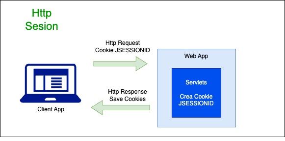
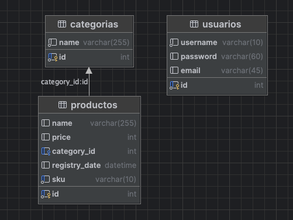

## JAVA project with JSP

Shopping cart Example using JSP and HttpSession to save user information

Contains Crud of users and products

### Database diagram

Cuando se crea la bd se crea el usuario root

ALTER USER 'root'@'localhost' IDENTIFIED BY '1234';
FLUSH PRIVILEGES;

Entrar a la carpeta de programas donde se tenga el tomcat instalado
y correr los siguientes comandos para mac

./startup.sh
./shutdown.sh

Ajuste de usuarios de tomcat en el archivo tomcat-users.xml
<user username="admin" password="1234" roles="admin,manager-gui,manager-script"/>

Cambio de servidor de tomcat a wildfly
